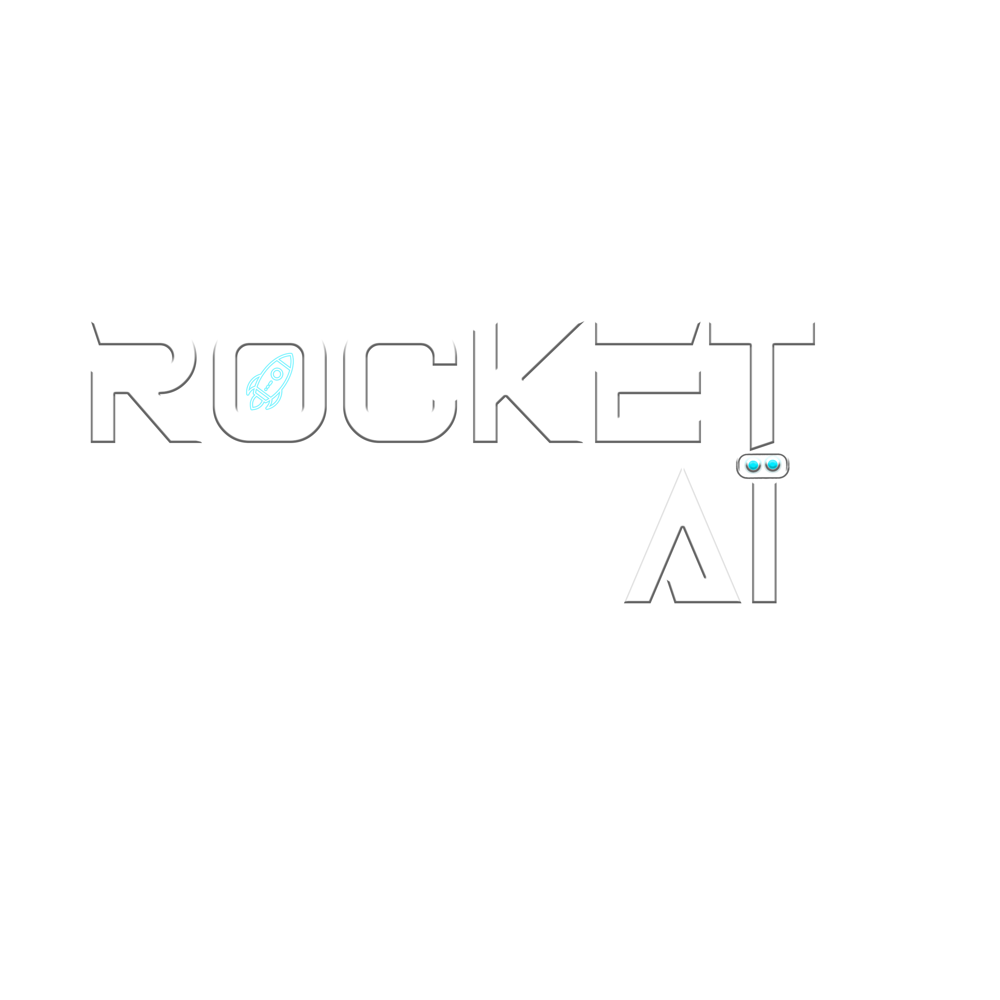

# Rocket Team AI - CAN AI PRESERVE OUR SCIENCE LEGACY?

## Who we are?
Our team is composed of Brazilian students, from various regions of the country, but who live in the cities of Campinas (São Paulo) and Montes Claros (Minas Gerais). Students Gabriel Xavier, João Caramês, Isabela Beneti and Ygor Fagundes attend Science and Technology at Ilum School of Science while Yago Maia attends Information Systems at Unimontes and Gustavo Matos is currently participating at the MIT Data Analysis and Statistics MicroMasters at MITx.

## What's going on here?
This work is related to the Space Apps program, which proposed some tasks, of which our group selected the theme called "CAN AI PRESERVE OUR SCIENCE LEGACY" to conduct research. The contents present in this repository come from the resolution of the chosen task. To do this, we use some advanced tools to process NASA's NTRS API in order to make the articles present in it more accessible to the reader.

## How to navigate our codes?
To explore our repository, you can start with the "data_preparation" document, in which we selected the data present in the NASA Technical Report Server (NTRS) and a simple treatment of this data. After that, you can explore the "summarization_process.py" file to learn how natural language processing (NLP) was used to summarize and translate the articles worked on. Then, you can open the "processed data" folder to see the final result obtained in this work.
